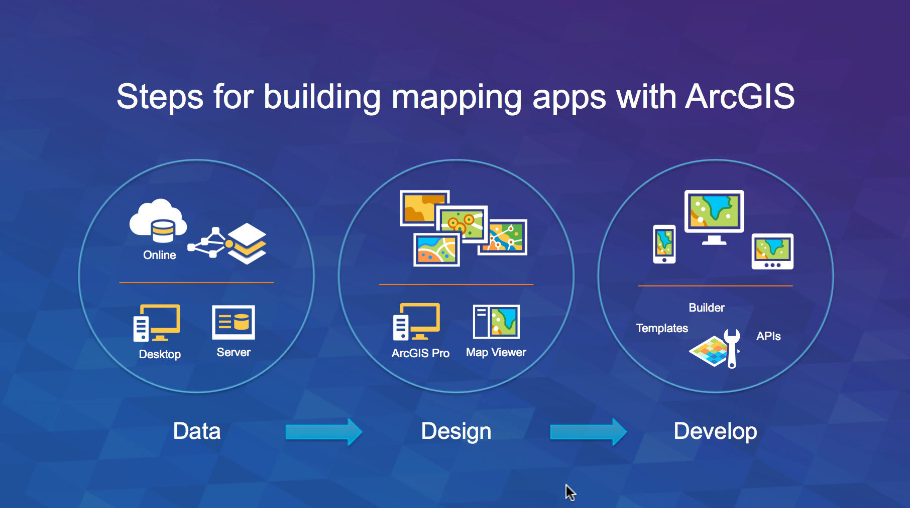

# geodev-hackerlab
A place for geodev hacker labs

### Get Started

[Sign up for an ArcGIS Developer subscription](https://developers.arcgis.com/en/sign-up/)

### Labs

Data (ArcGIS Online)
* [Import Data](./data/import data.md)
* [View Layer Data via REST](./data/view layer data via rest.md)
* [View a Layer in a Map](./data/view a layer in a map.md)
* [Enrich with Population Data](./data/enrich with population data.md)
* [Clip Data](./data/clip data.md)
* Create Buffers
* Create Drive Times
* 

Design (Map viewer)
* [Make a Map](./design/make a map.md)
* [Style Layers](./design/style layers.md)
* [Save Layers](./design/save layer styles.md)
* Configure popups
* Set Scale visibility
* Save layer with your credentials

Develop (Apps and APIs)
* Create a WAB app
* Create a Template App
* Create a ArcGIS JS App
* Create an Esri-leaflet App
* Create an AppStudio App

### Licensing
Copyright 2015 Esri

Licensed under the Apache License, Version 2.0 (the "License");
you may not use this file except in compliance with the License.
You may obtain a copy of the License at

> http://www.apache.org/licenses/LICENSE-2.0

Unless required by applicable law or agreed to in writing, software
distributed under the License is distributed on an "AS IS" BASIS,
WITHOUT WARRANTIES OR CONDITIONS OF ANY KIND, either express or implied.
See the License for the specific language governing permissions and
limitations under the License.

A copy of the license is available in the repository's [LICENSE](./license.txt) file.

